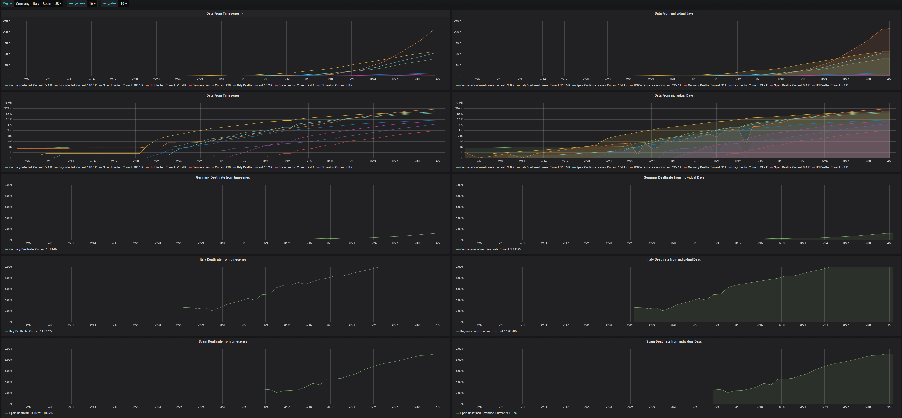

Corona_stats

Downloads the current statistics regarding covid 19 from the John
Hopkins University and transfers them into an Influx database.

Usage

1.Install Influxdb

2.Configure Influx and create database <covid_stats>

3.install script dependecies
    PyGithub => python3 -m pip install PyGithub
    influx   => python3 -m pip install influx
    progress => python3 -m pip install progress
4.run script once to create default settings
    fill Settings with values and run Script

The Script now loads available data when executed again.
The tables (measurements) <cases> and <timeseries> will be created, which
contain the Information in a nicer way then the CSV files do
the bear in mind, that the data is "raw" and due to some changes
in testing methodology around the world and changing storage 
formats / contents it may need to be cleaned first before you can use it.

Influx works very well with Grafana, which can be used to create visualisations of the data
an example dashboard is saved as json.

example image from Grafana dashboard

    
 